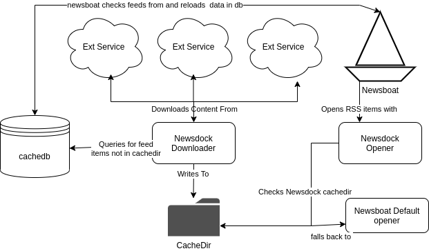

# Newsdock
A process to pre-cache certain files for newsboat so that can be viewed locally without an internet connection.

## How it works

The `newsdock_downloader` looks for all rss_items that have the tag: `cache` and attempts to download them from the corresponding `external service` if there is a valid `cache_protocol` defined.

The `newsdock_opener` looks for a file matching the `rss_item` in the `cache_dir`.
 If the file is not in the cache it will fall back to the default newsboat opening program.
